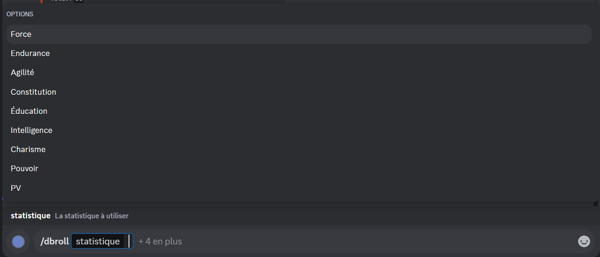

# Lanc de dés

Les deux commandes auront une auto-complétion sur les statistiques (ou le nom du dé pour la commande `dbd`) et le nom du personnage.

## DBRoll (`/dbroll`)

Le dbRoll aura les mêmes effets que la commande `/roll`, mais il vous demandera :
- La statistique (obligatoire, utilisera l'autocomplétion)
- le nom du personnage (avec une autocomplétion)
- Le modificateur à ajouter au jet (comme l'avantage, le désavantage, etc.)
- Le remplacement de la valeur de réussite (par exemple, pour un jet difficile) : Ne pas oublier de mettre comment la valeur est comparée ! (exemple : `>= 10`)
- N'importe quel personnage (qui doit être enregistré dans la base de données) — Note : Si vous n'avez qu'un seul personnage enregistré et que l'utilisateur ne met aucune valeur, le premier personnage enregistré sera utilisé.
- Tout commentaire sur votre action

## DBD (`/dbd`)

Le dbD aura les mêmes effets que la commande `/roll`, mais il vous demandera :
- La compétence (obligatoire, utilisera l'autocomplétion)
- le nom du personnage (avec une autocomplétion)
- Le modificateur à ajouter au jet (comme l'avantage, le désavantage, etc.)
- Tout commentaire sur votre action.

# Logs

La commande logs permet de choisir un channel dans lequel :
- Toute erreur sera transmise
- Toute modification qui a été faite sur un personnage sera transmis.

# Afficher

La commande affichée permet de voir les statistiques et les dés d'un personnage enregistré dans la base de données. Il vous demandera :
- Le joueur (qui accepte un utilisateur par mention)
- Et/ou un nom de personnage (qui accepte une autocomplétion).

Les deux ensemble permet de choisir le personnage d'un joueur précis (utile s'il y a des personnages avec le même nom, même si je doute que cela arrive).

