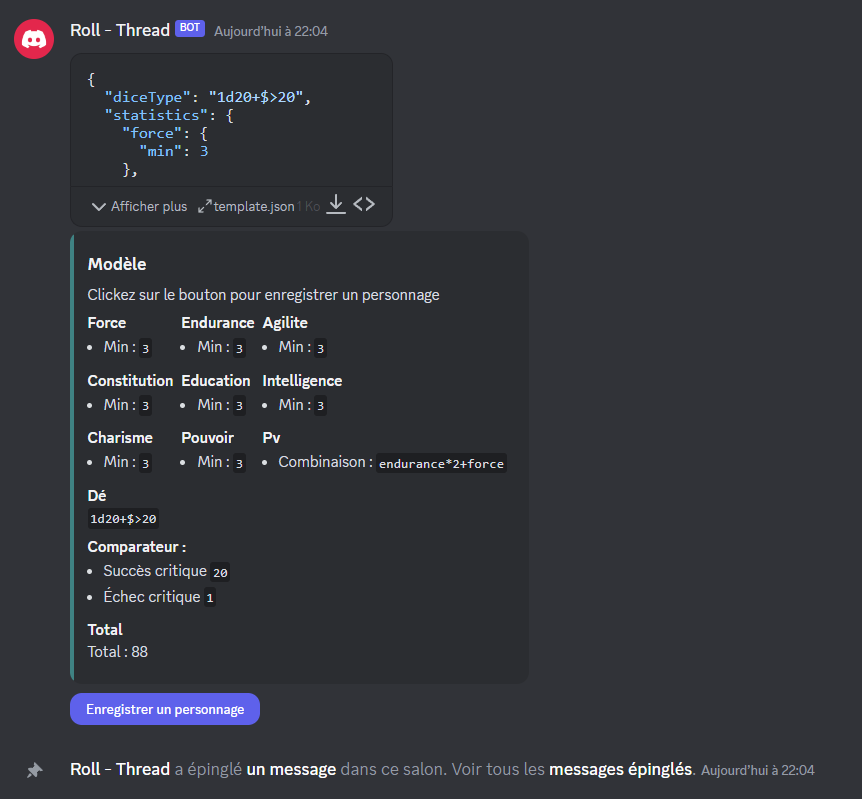

Tout d'abord, vous devez **générer** un nouveau modèle. Pour cela, vous devez utiliser la commande `!register_template` suivie du nom du modèle. Par exemple, pour créer un modèle de fiche de personnage, vous pouvez utiliser la commande suivante : `/générer`.

Cette commande vous permettra de créer un nouveau fichier `JSON`, et prendra les paramètres (facultatifs) suivant :
- `nom` : Le nom des statistiques à séparer par un espace ou une virgule. Si une des statistiques contient un espace, vous devez l'entourer de guillemets. Par exemple : `"Logique d'intelligence", Force, Dextérité`.
- `dé` : Le type de dés à lancer, qui peut contenir une formule (cf [#dés](#dés)).
- `total` : Si, à la création, vos joueurs ont un nombre de point à répartir. Malheureusement, il n'est pas possible de poser des conditions à ce total (par exemple, en fonction de l'âge du personnage, il n'aura que 60 points, et un personnage plus vieux aurait 70 points). Dans ces cas là, il vaut mieux prendre la valeur la plus haute et de vérifier manuellement.
- `personnage` : Vous pouvez rendre l'inscription d'un nom de personnage obligatoire avec cette option.
- `succès_critique` : En dés naturel, si un dé tombe sur cette valeur, il est considéré comme un succès critique.
- `échec_critique` : En dés naturel, si un dé tombe sur cette valeur, il est considéré comme un échec critique.
- `competence` : Permet de définir (lorsque la template sera éditée avant l'enregistrement) d'ajouter des champs pour des dés de compétences (ou d'attaque). Comme pour le nom, vous devez séparer les valeurs par une virgule.

Pour des example de template, vous pouvez voir les fichiers `template` [ici](https://github.com/Dicelette/discord-dicelette/tree/main/template) ou [encore ici](register/template).

# Dés

Il existe deux types de dés :
- Le dé qui sera lancé par la commande `dbroll`, qu'on appellera **dé type**.
- Les dés sauvegardés pour la commande `dbd`, qui seront nommé **dés enregistrés**.

Les deux dés doivent respecter la syntaxe de l'API de [dice-roller](https://dice-roller.github.io/documentation/), et peuvent supporter différente formule mathématiques. 

Dans les deux cas, vous pouvez utiliser la syntaxe `{{` et `}}` pour écrire des formules mathématiques complexe, comme `ceil`, `floor`, `round`, etc. Cependant, si vous souhaitez "viser" une statistique, la syntaxe sera différente en fonction de ce que vous utilisez :
- Les dés types visent uniquement la syntaxe utilisée dans la commande `dbroll`. Le signe pour indiquer une statistique est `$`.
- Les dés enregistrés visent la syntaxe utilisée dans la commande `dbd`. Puisque vous avez accès à toutes les statistiques, vous pouvez les viser directement avec leur nom.

:::tip[Exemple]
- Pour un dé type : `1d6>$` ou `1d6+$`
- Pour un dé enregistré : `1d6 > Force` ou `1d6 + Force`

Pour un dé basé sur une formule :
- Pour un dé type : `1d6 + {{ceil($ / 2)}}`
- Pour un dé enregistré : `1d6 + {{ceil(Force / 2)}}`

Il est aussi possible de comparer contre une formule :
- Pour un dé type : `1d6 > {{ceil($ / 2)}}`
- Pour un dé enregistré : `1d6 > {{ceil(Force / 2)}}`
:::

## Statistiques
Les statistiques sont basés sur un nom, mais vous remarquerez qu'après avoir générer le fichier, chaque statistique aura trois champs :
- min: La valeur minimale que la statistique peut avoir.
- max: La valeur maximale que la statistique peut avoir.
- combinaison : Si la statistique est une combinaison de plusieurs autres statistiques, vous pouvez l'indiquer ici. Par exemple, si la statistique `Esquive` est la somme de `Force` et `Dextérité`, vous pouvez l'indiquer ici. L'utilisation d'une combinaison annule automatiquement les valeurs `min` et `max`. De plus, les statistiques combinées ne seront pas calculée dans la somme du total.

<details>
  <summary>Modèle vide</summary>
  ```json
  {
  "charName": false,
  "statistics": {
    "NOM": {
      "min": 1,
	  "max": 20,
	  "combinaison": ""
    },
	"COMBINAISON": {
	  "combinaison": "NOM*2"
    },
  },
  "diceType": "",
  "critical": {
    "failure": 1,
    "success": 20
  },
  "total": 0,
  "damage": {
    "NOM": ""
  }
}
```
</details> 

## Et après ?

Une fois que le modèle a été créé et que vous en êtes satisfait·e, vous pouvez utiliser la commande `/register <channel> <fichier>`, dans laquel vous devez choisir :
- Le channel qui servira à la fois pour la création de nouveau personnage et où leur fiche sera repostée (dans un thread nommé `📝 • [STATS]`).
- Le fichier que vous venez de créer et éditer.

:::tip
Si vous voulez autoriser vos joueurs à modifier leur propre fiche, vous pouvez choisir un channel auquel ils ont accès. Cependant, si vous voulez que seul le MJ puisse modifier les fiches, vous pouvez choisir un channel privé.
:::

Pour des raisons pratiques, l'embed sera épinglé.

